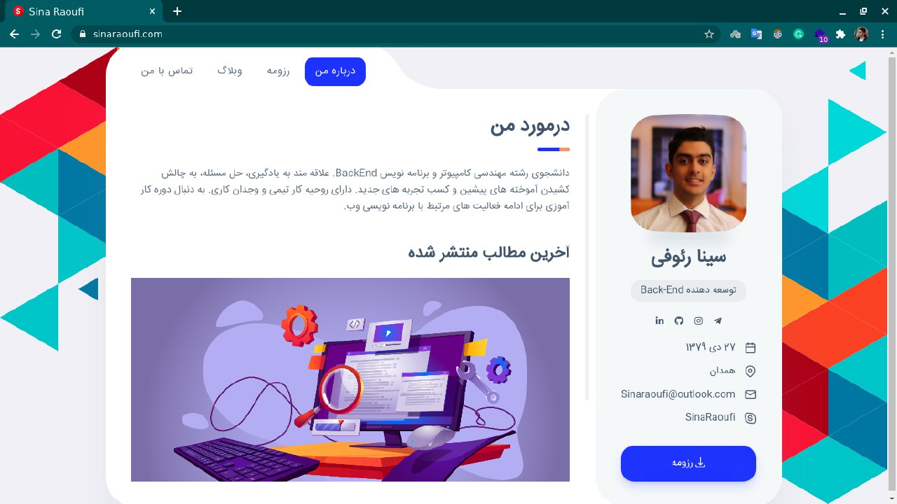

# django personal website

This repository contains a full-featured personal website built using the [django](https://www.djangoproject.com/start/overview/) web framework. It is designed to be easily customizable and extendable, making it a great starting point for building your own personal website.



## Setting up the Project
To run the project, follow these steps:

1. Clone the repository:
```
git clone https://github.com/SinaRaoufi/django-personal-website.git
```

2. Create a virtual environment and install the required packages:
```
cd django-personal-website
python -m venv venv
source venv/bin/activate
pip install -r requirements.txt
```
3. Run the migrations:
```
python manage.py migrate
```
4. Create a superuser to access the admin panel:
```
python manage.py createsuperuser
```
5. Run the server:
```
python manage.py runserver
```
Access the website at http://localhost:8000/ and the admin panel at http://localhost:8000/admin/.


## Customization
The project comes with a set of templates, stylesheets, and images. You can customize these to your liking by modifying the files in the `templates` and `assets` directory.

## Deployment
To deploy the project to a production server, you will need to configure a web server, such as Apache or Nginx, and a WSGI server, such as uWSGI or Gunicorn. You can find more information on deploying Django projects in the [official documentation](https://docs.djangoproject.com/en/3.2/howto/deployment/)
.

